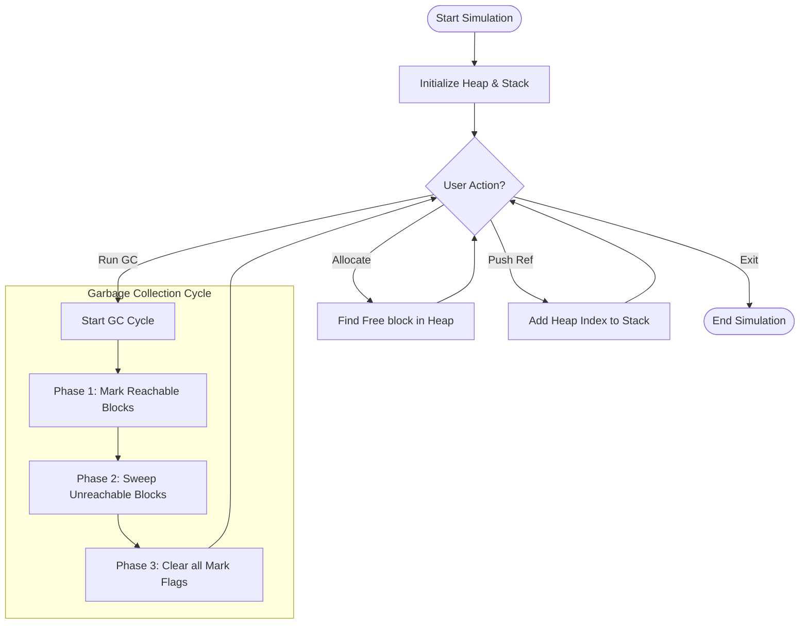

# Algorithm Flowcharts: Mark & Sweep

This document visualizes the logic flows of the project using Mermaid diagrams.

## 1. Overall System Lifecycle
This flowchart describes the interaction between the User, the Process Stack, and the Garbage Collector.

---

## 2. Allocation Algorithm Flow
Detailed flow of how memory blocks are allocated.

---

## 3. Push Reference Validation Flow
How the system validates and adds references to the stack.

---

## 4. Mark Phase Deep Dive
How the system identifies "Live" memory.

---

## 5. Sweep Phase Logic
The decision-making process for every block in memory during the sweep.

---

## 6. Complete GC Execution Sequence
Step-by-step execution of a full garbage collection cycle.

---

## 7. Frontend-Backend Architecture
How the web interface communicates with the C backend.

---

## 8. Memory Block State Machine
Lifecycle of a single memory block.

---

## 9. Why Mark-and-Sweep? (The Circular Reference Problem)
This diagram shows how we handle a circular reference that is no longer reachable from the roots.

---

## 10. Comparison: Mark-Sweep vs Reference Counting

