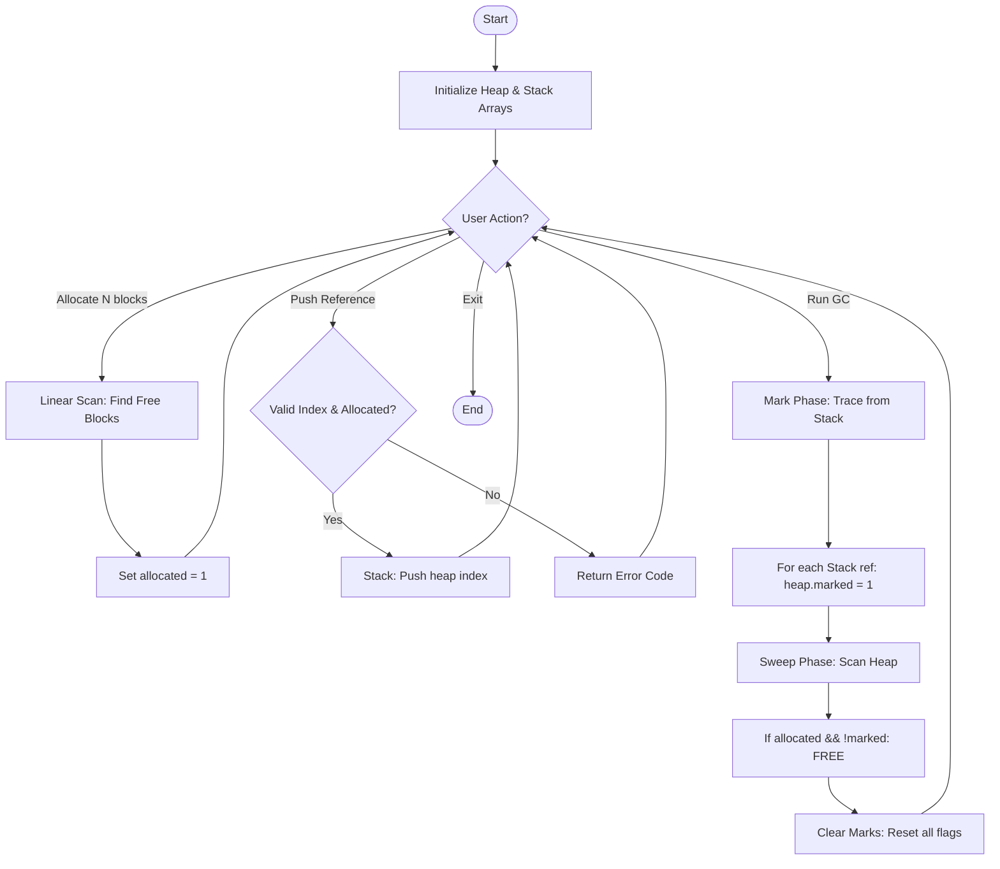

# GC Methodology Flowchart

This is a concise, memorable flowchart showing the complete Mark-and-Sweep garbage collection methodology.

---

## System Execution Flow (Complete Methodology)

---

## Key Algorithm Details

### Mark Phase (Reachability Tracing)
- **Input**: Process Stack (Root Set)
- **Process**: `for(i=0; i<=stack_top; i++) heap[stack[i]].marked = 1`
- **Complexity**: $O(R)$ where R = number of roots

### Sweep Phase (Memory Reclamation)
- **Process**: `for(i=0; i<HEAP_SIZE; i++) if(allocated && !marked) allocated=0`
- **Complexity**: $O(H)$ where H = heap size
- **Result**: All unreachable blocks freed

### Total GC Complexity
- **Time**: $O(R + H)$ = Linear
- **Space**: $O(1)$ = In-place algorithm

---

## Data Structure Summary

| Structure | Implementation | Purpose |
|:----------|:--------------|:--------|
| **Heap** | `Block heap[HEAP_SIZE]` | Static array of memory blocks |
| **Stack** | `int stack[STACK_SIZE]` | Root references (live objects) |
| **Block** | `{allocated, marked}` | 2 flags per memory block |

---

## Why Mark-and-Sweep?

**Problem Solved**: Circular references (A→B, B→A, but no root→A)
- **Reference Counting**: Would leak (counts never reach 0)
- **Mark-and-Sweep**: Correctly identifies as garbage ✓

**Trade-off**: "Stop-the-world" pause during GC
- **Solution in Production**: Incremental/Concurrent marking (Java G1, Python)
